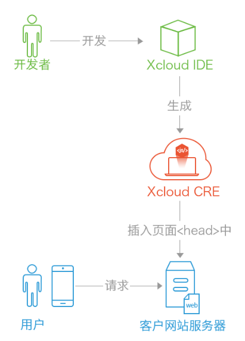

# 关于Xcloud平台介绍

 

&nbsp;&nbsp;&nbsp;&nbsp;&nbsp;&nbsp;&nbsp;&nbsp;Xcloud网站跨屏云系统是云深互联（北京）科技有限公司基于原PC网站通过使用Xcloud的一行代码部署方式，可以帮助企业快速将电脑版网站适配到各种移动终端设备，在线适配并一键发布，同时享受云端优化加速功能。不仅能显著提高企业网站的在移动端的用户体验以及销售转化率，而且能大幅度地节省企业移动端开发、维护以及推广网站的费用。

 

## 1、产品定位

 

&nbsp;&nbsp;&nbsp;&nbsp;&nbsp;&nbsp;&nbsp;&nbsp;Xcloud网站跨屏云可以帮助企业快速、安全、高效地将现有PC版网页适配成HTML5移动应用。跨屏云根据用户设备，实时重新渲染网页应用的内容，使之以最佳的展示及交互方式呈现在任意移动终端，让用户无论在任何设备/平台上都能享受到极致的使用体验，提高用户满意度和转化率，是企业与政府的门户网站移动化最佳选择。
Xcloud网站跨屏云从2012年9月以来已经服务于三十多万个网站移动化适配客户，系统通过拖拽、简单编写前端代码来完成网站的移动化。支持iOS、 Android等任何屏幕大小无缝访问。产品适用于对原有PC端网站进行移动化的需求客户。无需触及企业程序后台接口，体系化地打造整个网站的的移动信息化，合二为一， 实现数据互通、多端同步，业务协同的效果。

 

## 2、产品架构

 

**Xcloud网站跨屏云系统由两大部分组成：**

&nbsp;&nbsp;&nbsp;&nbsp;&nbsp;&nbsp;&nbsp;&nbsp;Xcloud IDE (Integrated Development Environment) ：Xcloud 集成开发环境，用于便捷的快速适配，以及深度的定制用户个性化的适配需求。

&nbsp;&nbsp;&nbsp;&nbsp;&nbsp;&nbsp;&nbsp;&nbsp;Xcloud CRE (Cloud Rendering Engine)：Xcloud 云渲染引擎，也就一行代码所引用的整个适配的程序。

 

&nbsp;&nbsp;&nbsp;&nbsp; **2.1、Xcloud IDE：** 
&nbsp;&nbsp;&nbsp;&nbsp;&nbsp;&nbsp;&nbsp;&nbsp;不同的企业对网站移动端化的展示风格都有自己的独特要求，Xcloud网站跨屏云在打造初期就尽可能的提供多样化的选择，多元化的展示风格。云适配独创的在线开发工具—Xcloud（跨屏云）IDE，帮助企业开发人员随时随地所见即所得的方式在线调试网页样式，实现最佳的个性化跨屏展示效果。
我们提供了一系列的组件，供用户快速建站，极大的减少了开发的难度及成本，适配人员只需要具备基础的前端技术即可快捷得将原PC网站实现信息移动化建设。此外，适配人员无需在自己机器上安装任何软件，云适配Xcloud网站跨屏云提供的适配工具为在线浏览器访问,大大解决了用户安装的烦恼。

&nbsp;&nbsp;&nbsp;&nbsp; **2.2、Xcloud CRE：** 
&nbsp;&nbsp;&nbsp;&nbsp;&nbsp;&nbsp;&nbsp;&nbsp;网页适配的运行代码，它会判断当前用户浏览网页的设备类型，如果是移动设备，则对网页进行重构，并渲染成最适合当前设备浏览的页面样式，使用户体验达到最佳效果。它通过在网页的头部加一行Script代码来安装。

 

 

## 3、产品适配原理

 

## 4、产品功能

 

## 4、产品特点

 

## 4、产品特点

 

> 西安云适配xcloud技术文档

For a detailed explanation on how things work, check out the [guide](http://vuejs-templates.github.io/webpack/) and [docs for vue-loader](http://vuejs.github.io/vue-loader).
