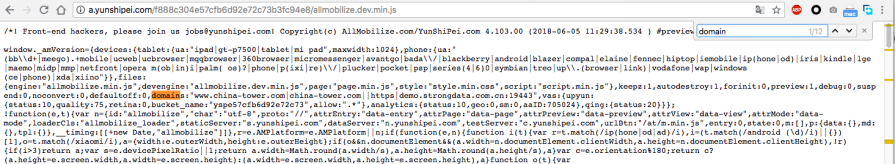
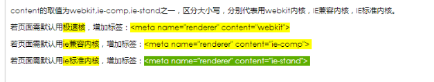

# 正式版适配效果丢失问题排查

<br>

## 一、检查一句话代码是否添加正常

<br>

<b>&nbsp;&nbsp;&nbsp;&nbsp;&nbsp;&nbsp;&nbsp;&nbsp;描述：</b>从PC端复制添加的一句话代码与项目的一句话代码是否相吻合,目前出现的一些问题极有可能是客户在进行代码添加时，在某些页面漏加了一句话代码导致适配失效。

<br>

## 二、检查适配项目中是否有代码报错

<br>

<b>&nbsp;&nbsp;&nbsp;&nbsp;&nbsp;&nbsp;&nbsp;&nbsp;描述：</b>因为PC端某些数据的变化或导致dom结构的变化,以及适配人员在项目适配时未进行报错处理，导致某些API节点为null或undefined导致项目报错，从而最终导致适配效果丢失。

<br>

<b>&nbsp;&nbsp;&nbsp;&nbsp;&nbsp;&nbsp;&nbsp;&nbsp;解决思路：</b>在chrome模拟器中打开控制台进行报错查看，进行问题排查及适配代码整改。

<br>

## 三、检视适配项目中是否有使用ES6语法

<br>

<b>&nbsp;&nbsp;&nbsp;&nbsp;&nbsp;&nbsp;&nbsp;&nbsp;描述：</b>使用了ES6语法后，在预览版上是正常输出(有时会出现项目丢失效果),但正式发布后控制台无报错，适配效果丢失。

<br>

<b>&nbsp;&nbsp;&nbsp;&nbsp;&nbsp;&nbsp;&nbsp;&nbsp;原因：</b>Xcloud平台不支持ES6语法。

<br>

<b>&nbsp;&nbsp;&nbsp;&nbsp;&nbsp;&nbsp;&nbsp;&nbsp;解决思路：</b>进行项目代码整改，在全局search搜索ES6相关语法,查看是否存在ES6相关语法。

<br>

## 四、查看插入的js，检查domains是否包含有该域名

<br>

<b>&nbsp;&nbsp;&nbsp;&nbsp;&nbsp;&nbsp;&nbsp;&nbsp;描述：</b>注意如果是IP地址的测试环境，domains中不需要含有端口号，否则会不适配。如图：

<br>



<br>

<b>&nbsp;&nbsp;&nbsp;&nbsp;&nbsp;&nbsp;&nbsp;&nbsp;解决思路：</b>可通过在IDE中添加域名别名来解决

<br>


## 五、对适配报路径进行访问，测试是否能访问到代码包

<br>

<b>&nbsp;&nbsp;&nbsp;&nbsp;&nbsp;&nbsp;&nbsp;&nbsp;描述：</b>适配效果丢失，有可能是项目代码包访问不到，可直接打开PC端检查，对一句话代码进行右击访问测试，在进行下一步排查。

<br>


## 六、插入代码后出现的兼容性问题

<br>



<br>

<b>&nbsp;&nbsp;&nbsp;&nbsp;&nbsp;&nbsp;&nbsp;&nbsp;问题原理分析：</b>因对方原PC网站在IE7下就存在着兼容性问题，如果我们的代码直接放置第一行head头，可能会改变360的IE兼容浏览器默认等级(如从默认IE11变成了默认IE7)。

<br>

<b>&nbsp;&nbsp;&nbsp;&nbsp;&nbsp;&nbsp;&nbsp;&nbsp;解决思路：</b>我们的js代码放于&lt;meta name= "renderer" content = "webkit"&gt;这行代码下即可。后续客户有这种360或者IE插入我们的代码后，出现兼容性问题的都可以这样来解决。

<br>

<b>&nbsp;&nbsp;&nbsp;&nbsp;&nbsp;&nbsp;&nbsp;&nbsp;引申：</b>如果在IE8有问题，可以增加以下标签：&lt;meta http-equiv="X-UA-Compatible" content="IE=edge"&gt;,代表以最高级模式渲染文档 来解决这个问题。

<br>

<b>&nbsp;&nbsp;&nbsp;&nbsp;&nbsp;&nbsp;&nbsp;&nbsp;X-UA-Compatible是神马？</b> 

<br>

<b>&nbsp;&nbsp;&nbsp;&nbsp;&nbsp;&nbsp;&nbsp;&nbsp;&nbsp;&nbsp;&nbsp;&nbsp;&nbsp;&nbsp;&nbsp;&nbsp;文档：</b>https://www.modern.ie/en-us/performance/how-to-use-x-ua-compatible 

<br>

&nbsp;&nbsp;&nbsp;&nbsp;&nbsp;&nbsp;&nbsp;&nbsp;&nbsp;&nbsp;&nbsp;&nbsp;&nbsp;&nbsp;&nbsp;&nbsp;X-UA-Compatible是IE8的一个专有&lt;meta&gt;属性，它告诉IE8采用何种IE版本去渲染网页，在html的&lt;head&gt;标签中使用。可以在微软官方文档获取更多介绍。

<br>

<b>&nbsp;&nbsp;&nbsp;&nbsp;&nbsp;&nbsp;&nbsp;&nbsp;为什么要用X-UA-Compatible？</b> 

<br>

&nbsp;&nbsp;&nbsp;&nbsp;&nbsp;&nbsp;&nbsp;&nbsp;&nbsp;&nbsp;&nbsp;&nbsp;&nbsp;&nbsp;&nbsp;&nbsp;在IE8刚推出的时候，很多网页由于重构的问题，无法适应较高级的浏览器，所以使用X-UA-Compatible标签强制IE8采用低版本方式渲染。 

<br>

<b>&nbsp;&nbsp;&nbsp;&nbsp;&nbsp;&nbsp;&nbsp;&nbsp;&nbsp;&nbsp;&nbsp;&nbsp;&nbsp;&nbsp;&nbsp;&nbsp;参考：</b>http://zccst.iteye.com/blog/2162187

<br>

## 七、适配网站被百度转码

<br>

<b>&nbsp;&nbsp;&nbsp;&nbsp;&nbsp;&nbsp;&nbsp;&nbsp;描述：</b>如果用户的网站加了&lt;meta http-equiv="Cache-Control" content="no-transform" /&gt;依旧被转码，可到百度的站长中心-反馈中心进行反馈。可能百度爬虫存在误杀的情况。如果之前没加过，则添加该代码，过几天即可。

<br>

<b>&nbsp;&nbsp;&nbsp;&nbsp;&nbsp;&nbsp;&nbsp;&nbsp;反馈中心：</b>https://ziyuan.baidu.com/feedback/index

<br>

<b>&nbsp;&nbsp;&nbsp;&nbsp;&nbsp;&nbsp;&nbsp;&nbsp;引申——no-transform协议：</b>那么，如果站长不希望自己的站点被转码、依然希望手机端用户浏览PC页该如何操作呢？可以使用no-transform协议，no-transform协议为如下两种形式：

<br>

&nbsp;&nbsp;&nbsp;&nbsp;&nbsp;&nbsp;&nbsp;&nbsp;第一种，HTTP Response中显式声明Cache-control为no-transform。 

<br>

&nbsp;&nbsp;&nbsp;&nbsp;&nbsp;&nbsp;&nbsp;&nbsp;第二种，meta标签中显式声明Cache-control为no-tranform，格式为：

<br>

```html 
　　<head> 
　　    <meta http-equiv="Cache-Control" content="no-transform " /> 
　　</head> 
```

<br>

<b>&nbsp;&nbsp;&nbsp;&nbsp;&nbsp;&nbsp;&nbsp;&nbsp;相关链接地址：</b>http://zhanzhang.baidu.com/college/articleinfo?id=233

<br>

<div style="color: red;">

<b>&nbsp;&nbsp;&nbsp;&nbsp;&nbsp;&nbsp;&nbsp;&nbsp;注意：</b>加上no-transform协议后不会立即生效，大约需要一周时间。

</div>

<br>
