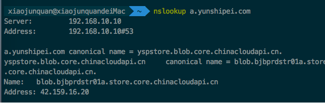
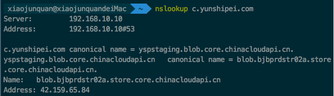
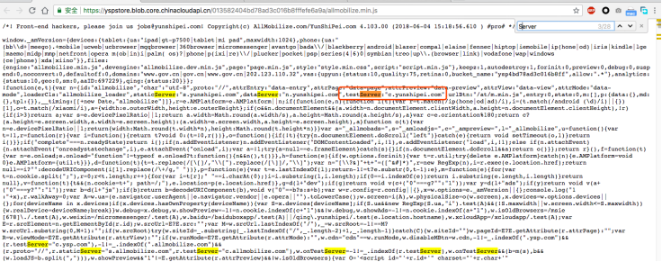

# 预览版不适配问题解析

 

## 一、IP + 端口形式的PC端测试网站不适配

 

<b>&nbsp;&nbsp;&nbsp;&nbsp;&nbsp;&nbsp;&nbsp;&nbsp;1、问题描述：</b>对于域名是IP+端口的形式的测试网站，适配可能无法生效

 

<b>&nbsp;&nbsp;&nbsp;&nbsp;&nbsp;&nbsp;&nbsp;&nbsp;2、解决方案：</b>域名别名中不添加端口号

 

## 二、服务器白名单

 

<b>&nbsp;&nbsp;&nbsp;&nbsp;&nbsp;&nbsp;&nbsp;&nbsp;1、问题描述：</b>项目创建完成，预览版抓取问题，其它问题排查未报错

 

<b>&nbsp;&nbsp;&nbsp;&nbsp;&nbsp;&nbsp;&nbsp;&nbsp;2、解决方案：</b>与客户进行确认是否PC服务器端增加了安全机制，如果网站做了防抓取等限制的话，XCLOUD服务器抓取数据的IP地址为：139.217.1.38， 增加该IP地址到对方网络白名单即可。

 

## 三、https不适配

 

<b>&nbsp;&nbsp;&nbsp;&nbsp;&nbsp;&nbsp;&nbsp;&nbsp;1、问题描述：</b>对于https的网站，云适配Xcloud无法在线预览，插入代码也无法适配

 

<b>&nbsp;&nbsp;&nbsp;&nbsp;&nbsp;&nbsp;&nbsp;&nbsp;2、背景描述：</b>浏览器默认是不允许在 https 里面引用 http 资源的，以前一般都会弹出提示框。随着技术的发展，现在的浏览器对于此种情况直接不加载或报错该请求资源。所以导致xcloud无法在线预览，插入代码也无法适配。

 

<b>&nbsp;&nbsp;&nbsp;&nbsp;&nbsp;&nbsp;&nbsp;&nbsp;3、临时解决方案：</b></b>因云适配的相关适配资源存在微软的blob服务器中，微软blob的真实请求链接支持Https的访问。所以，我们可将插入的代码,如：http://a.yunshipei.com/013582404bd78ad3c016b8fffefe6a9a/allmobilize.min.js    替换成微软的域名，并变更为https即可，如：https://yspstore.blob.core.chinacloudapi.cn/013582404bd78ad3c016b8fffefe6a9a/allmobilize.min.js

 

<b>&nbsp;&nbsp;&nbsp;&nbsp;&nbsp;&nbsp;&nbsp;&nbsp;4、相关操作：</b>可通过在命令终端通过nslookup指令查询，可以查到DNS记录的生存时间还可以指定使用哪个DNS服务器进行解释。格式如下：

 

 

 

<b>&nbsp;&nbsp;&nbsp;&nbsp;&nbsp;&nbsp;&nbsp;&nbsp;5、私有部署 发布测试版临时解决方案：</b>客户不想加了代码后影响正式环境，可能过修改allmobilize.min.js文件中的testServer解决，修改成 yspstaging.blob.core.chinacloudapi.cn 即可。

 

 

 

 

 

<b>&nbsp;&nbsp;&nbsp;&nbsp;&nbsp;&nbsp;&nbsp;&nbsp;6、最终建议解决方案：</b>将XCLOUD整体架设成HTTPS的链接。包括预览地址或者最少也应该保证a.yunshipei.com，和 c.yunshipei.com 是https的。

 