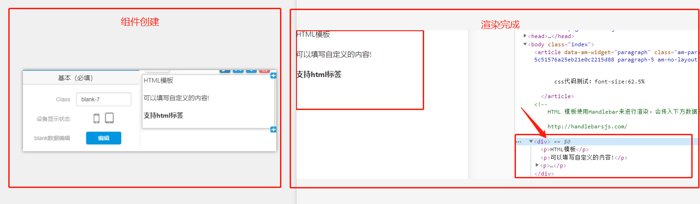

# 特殊需求的组件定制化封装

<br>

<div style="color: red;">

<b>&nbsp;&nbsp;&nbsp;&nbsp;&nbsp;&nbsp;&nbsp;&nbsp;注意：</b>当使用自定义组件时，IDE平台的class名是不会在适配项目中的DOM中被渲染出来的，所以为了避免类名的重复，我们需要在自定义组件中的DOM重构中将class添加进最外层的DOM中。

</div>

<br>



<br>

## 一、无缝轮播自定义封装

<br>

&nbsp;&nbsp;&nbsp;&nbsp;&nbsp;&nbsp;&nbsp;&nbsp;1、封装自定义API预处理DOM函数

```javascript

    /*
    * 自定义组件数据预处理————无缝轮播 
    * @$ : zepto对象
    * @tar : $的DOM对象 
    *
    **/
    seamlessCarousel : function( $ , tar ) {
        // 1、声明list变量：存储每一个轮播li
        var list = "";
        // 2、DOM重组
        tar.each(function(i){
            list += "<li><a href="+ $(this).attr("href") +"></a></li>";
        });
        
        // 3、返回
        return list;
        
    }

```

&nbsp;&nbsp;&nbsp;&nbsp;&nbsp;&nbsp;&nbsp;&nbsp;2、数据采集中的使用

```javascript

/*
 * 数据预处理：
 * 直接调用了封装在自定义API中的方法
*/

// 1、声明需要循环的父对象
var tar = $(".side_right .down .newsInfo").find("a");


var data = {
    title: $(".side_right .down .title").html(),
    content: context._helpers.seamlessCarousel( $ , tar )
};
return data;

```

&nbsp;&nbsp;&nbsp;&nbsp;&nbsp;&nbsp;&nbsp;&nbsp;3、HTML模板中的DOM重组
```html

 <div class="Dblank-1">
    <div class="title">
        {{{ title }}}
    </div>
    <div class="boxContainer">
        <ul class="banner">
            {{{ content }}}    
        </ul>    
    </div>
 </div>

```
&nbsp;&nbsp;&nbsp;&nbsp;&nbsp;&nbsp;&nbsp;&nbsp;4、样式封装

```less
/*
 * 自定义组件无缝轮播样式封装
 * 说明：
 *    1)、调用less函数不可跳过传参
 *    2)、封装该函数type主要针对头部样式的变换
 *    3)、在该函数中，轮播图片是有设置了宽高的，但可以进行跟参调整
 * 约束：请注意DOM结构
 * @type 类型——可选封装组件类型
 *  [
 *     { // 类型1 ———— 白底主色调icon
 *          type1           参数说明：简约类型头部 【必填】
 *          @titleHeight    参数说明：标题栏高度 【选填】 默认40px    单位 px/rem/em;
 *          @bannerWidth    参数说明：图片宽度 【选填】 默认200px    单位 px/rem/em;
 *          @bannerHeight   参数说明：图片及容器高度 【选填】 默认125px    单位 px/rem/em; 
 *     }
 *  ] 
 *
**/

.seamlessCarouselPublicSet(@bannerWidth,@bannerHeight){
    border-bottom: 4px solid @lineC;
    .boxContainer{
        margin: 10px;
        position: relative;
        overflow-x: auto;
        overflow-y: hidden;  
        position: relative;
        height: @bannerHeight;
        background: #fff;
        ul{
            .resize;
            position: absolute;
            top: 0;
            left: 0;
            list-style-type: none;
            display: flex;
            flex-direction: row;
            flex-wrap: nowrap;
            overflow-x: auto;
            overflow-y: hidden;
            li{
                padding: 0 10px;
                position: relative;
                width: @bannerWidth;
                max-height: @bannerHeight;
                a{
                    display: block;
                    width: 100%;
                    img{
                        width: 200px;
                        height: @bannerHeight;
                    }
                    .imgName{
                        .resize;
                        position: absolute;
                        bottom: 0px;
                        left: 0px;
                        width: 190px;
                        color: #fff;
                        text-align: center;
                        background: rgba(0,0,0,0.6);
                    }
                }
                
            }
            li:first-child{
                padding-left: 0;
                .imgName{
                    left: 10px;
                    width: 180px;    
                }    
            }
            li:last-child{
                padding-right: 0;
            }
            li:not(:first-child){
                padding-left: 0;
            }
        } 
    }
}

.seamlessCarouselType1(@titleHeight){ // 自定义无缝轮播组件类型1——头部简约类型
    .title{
        padding: 0 10px;
        height: @titleHeight;
        border-bottom: 1px solid @mc;
        a{
            display: block;
            color: @mc;
            line-height: 40px;
            text-decoration: none;
            .flex;
            span:first-child{
                font-weight: 600;
            }
            span:last-child{
                color: @fc2; 
                font-size: 14px;
            }
        }
    }    
}

.seamlessCarouselPublic(@type,@titleHeight:40px,@bannerWidth:200px,@bannerHeight:125px,) when ( @type = type1 ){
    .seamlessCarouselType1(@titleHeight);
    .seamlessCarouselPublicSet(@bannerWidth,@bannerHeight);    
}


.Dblank-1{ // type1 调用
    .seamlessCarouselPublic(type1); 
}

```

&nbsp;&nbsp;&nbsp;&nbsp;&nbsp;&nbsp;&nbsp;&nbsp;5、全局轮播函数封装

```javascript

    /*
     * 无缝轮播函数封装
     * @tar: 封装的组件中的轮播部分 【组件名 .banner】
     * @direction: 轮播图方向 【数字】 ： 大于0向右滑动，小于0向左滑动 !!该参数不能为0
     * 
    **/    
    var seamlessCarousel = function(tar,direction){
        var ul = tar;
        var ulHtml = ul.html();
        ul.html( ulHtml + ulHtml );
        
        var li = tar.find("li");
        var liWidth = li.eq(0).width();
        var liSize = li.size();
        var ulWidth = liWidth*liSize;
        ul.width( ulWidth );
        
        var speed = direction; // 正数为向左轮播;负数为向右轮播
        var num = 0;
            
        function slider(){
            // 向左滑动处理函数
            if( speed < 0 ){
                if( ul.css("left")== ((-ulWidth/2)+'px') ){
                    num = 0;
                }
                num--;
                ul.css("left",num+"px");
            }
            // 向右滑动处理函数
            if( speed > 0 ){
                if( ul.css("left")== "0px" ){
                    num = -ulWidth/2;    
                }
                num++;
                    ul.css("left",num+"px");
                }
            }
                    
            var timer = setInterval(slider,30);
    };  
        
    // 函数调用
    $(".Dblank-1").length && seamlessCarousel( $(".Dblank-1 .banner") ,  1 );

```
&nbsp;&nbsp;&nbsp;&nbsp;&nbsp;&nbsp;&nbsp;&nbsp;6、效果展示

<br>


<br>

## 二、一级菜单栏自定义组件封装

