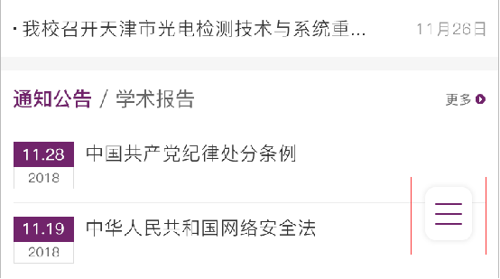
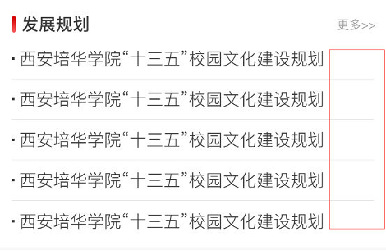
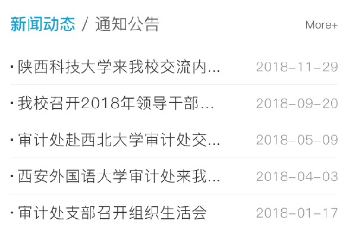
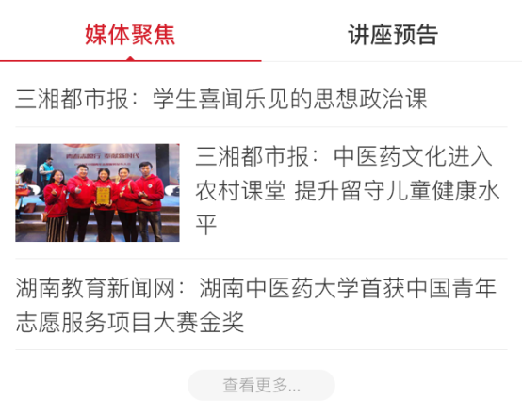
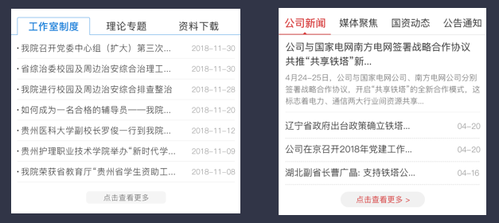
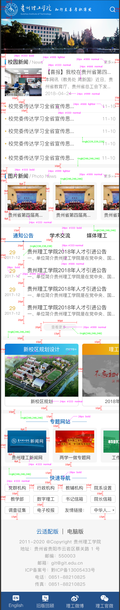

# 开发视觉规范

 
 

## 一、LOGO栏目

 

&nbsp;&nbsp;&nbsp;&nbsp;&nbsp;&nbsp;&nbsp;&nbsp;Logo栏目一般包括logo，搜索按钮，导航按钮，背景图片等元素。

 

&nbsp;&nbsp;&nbsp;&nbsp;&nbsp;&nbsp;&nbsp;&nbsp;1、只有LOGO 

&nbsp;&nbsp;&nbsp;&nbsp;&nbsp;&nbsp;&nbsp;&nbsp;&nbsp;&nbsp;&nbsp;&nbsp;&nbsp;&nbsp;&nbsp;&nbsp;此种情况下，适用于LOGO较长，且需要展示其它元素（solgan，以logo，标志建筑为背景等）。

 

 

&nbsp;&nbsp;&nbsp;&nbsp;&nbsp;&nbsp;&nbsp;&nbsp;2、LOGO和搜索 

&nbsp;&nbsp;&nbsp;&nbsp;&nbsp;&nbsp;&nbsp;&nbsp;&nbsp;&nbsp;&nbsp;&nbsp;&nbsp;&nbsp;&nbsp;&nbsp;此种情况下，适用于LOGO较长，不能同时放下搜索和导航按钮，或者无导航按钮。 

 

 

&nbsp;&nbsp;&nbsp;&nbsp;&nbsp;&nbsp;&nbsp;&nbsp;3、LOGO、搜索和导航 

&nbsp;&nbsp;&nbsp;&nbsp;&nbsp;&nbsp;&nbsp;&nbsp;&nbsp;&nbsp;&nbsp;&nbsp;&nbsp;&nbsp;&nbsp;&nbsp;此种情况是在logo可以正常显示清楚的基础上，搜索和导航也有安全的触发热区。 

 

 

## 二、导航栏

 

&nbsp;&nbsp;&nbsp;&nbsp;&nbsp;&nbsp;&nbsp;&nbsp;1、若导航按钮没有在头部区域放置，可以将导航按钮固定在手机屏幕右下方。建议采用加阴影的手
法，让菜单漂浮在页面内容之上。

 

 

&nbsp;&nbsp;&nbsp;&nbsp;&nbsp;&nbsp;&nbsp;&nbsp;&nbsp;&nbsp;&nbsp;&nbsp;&nbsp;&nbsp;&nbsp;&nbsp;注意：阴影不要加的太深，避免生硬感 

 

&nbsp;&nbsp;&nbsp;&nbsp;&nbsp;&nbsp;&nbsp;&nbsp;2、导航栏分为两种，一种隐藏式，通过点击按钮侧滑等方式显示；另一种是直接展示。 

&nbsp;&nbsp;&nbsp;&nbsp;&nbsp;&nbsp;&nbsp;&nbsp;&nbsp;&nbsp;&nbsp;&nbsp;&nbsp;&nbsp;&nbsp;&nbsp;a)、侧滑 
&nbsp;&nbsp;&nbsp;&nbsp;&nbsp;&nbsp;&nbsp;&nbsp;&nbsp;&nbsp;&nbsp;&nbsp;&nbsp;&nbsp;&nbsp;&nbsp;&nbsp;&nbsp;&nbsp;&nbsp;&nbsp;&nbsp;&nbsp;&nbsp;航栏默认采用侧滑样式，基本适用所有的导航。 
&nbsp;&nbsp;&nbsp;&nbsp;&nbsp;&nbsp;&nbsp;&nbsp;&nbsp;&nbsp;&nbsp;&nbsp;&nbsp;&nbsp;&nbsp;&nbsp;b)、直接展示 
&nbsp;&nbsp;&nbsp;&nbsp;&nbsp;&nbsp;&nbsp;&nbsp;&nbsp;&nbsp;&nbsp;&nbsp;&nbsp;&nbsp;&nbsp;&nbsp;直接展示对导航的数量，导航的字数有一定的要求，根据实际情况可选择采取此种方式。（首
页的链接写在logo上，可用此方法凑导航个数） 

 

 

## 三、焦点图

 

&nbsp;&nbsp;&nbsp;&nbsp;&nbsp;&nbsp;&nbsp;&nbsp;焦点图一般设置通栏；需要注意，大部分情况下，在设置图片尺寸的时候，只设置宽度的100%尺
寸，尽量避免同时设置宽高，防止图片变形。 

&nbsp;&nbsp;&nbsp;&nbsp;&nbsp;&nbsp;&nbsp;&nbsp;&nbsp;&nbsp;&nbsp;&nbsp;&nbsp;&nbsp;&nbsp;&nbsp;1.图片宽度很大，高度较小 
&nbsp;&nbsp;&nbsp;&nbsp;&nbsp;&nbsp;&nbsp;&nbsp;&nbsp;&nbsp;&nbsp;&nbsp;&nbsp;&nbsp;&nbsp;&nbsp;&nbsp;&nbsp;&nbsp;&nbsp;&nbsp;&nbsp;&nbsp;&nbsp;此情况下，通栏适配到手机上，可能存在图片内容看不清楚。可以选择重新切图解决，但不建议使
用，此方法会将图片写死，如果pc端图片更换，手机不会跟着变化。若使用此方法，需和客户沟通
说明。 

 

 

&nbsp;&nbsp;&nbsp;&nbsp;&nbsp;&nbsp;&nbsp;&nbsp;&nbsp;&nbsp;&nbsp;&nbsp;&nbsp;&nbsp;&nbsp;&nbsp;2.图片是原始拍摄的，无规律可言 
&nbsp;&nbsp;&nbsp;&nbsp;&nbsp;&nbsp;&nbsp;&nbsp;&nbsp;&nbsp;&nbsp;&nbsp;&nbsp;&nbsp;&nbsp;&nbsp;&nbsp;&nbsp;&nbsp;&nbsp;&nbsp;&nbsp;&nbsp;&nbsp;此情况一般出现在图片新闻部分，配图都是随机拍摄的，因此尺寸存在很大的差入。这种图片可以
选择将尺寸写死，但需注意比例，尽量保证变形较小（这种一般pc端也会写死发生变形，可注意观
察）

 

 

&nbsp;&nbsp;&nbsp;&nbsp;&nbsp;&nbsp;&nbsp;&nbsp;&nbsp;&nbsp;&nbsp;&nbsp;&nbsp;&nbsp;&nbsp;&nbsp;注意：此图已写死发生变形

 

## 四、新闻列表

 

&nbsp;&nbsp;&nbsp;&nbsp;&nbsp;&nbsp;&nbsp;&nbsp;新闻列表主要由标题，查看更多按钮，新闻标题，时间等组成。此处主要需要注意的是字体的规范，
包括字体大小、字体颜色、字体粗细等；需要注意的是若没有时间，标题长度控制到80%-90%，不要
占一整行。

 

 

&nbsp;&nbsp;&nbsp;&nbsp;&nbsp;&nbsp;&nbsp;&nbsp;&nbsp;&nbsp;&nbsp;&nbsp;&nbsp;&nbsp;&nbsp;&nbsp;&nbsp;&nbsp;&nbsp;&nbsp;&nbsp;&nbsp;&nbsp;&nbsp;&nbsp;&nbsp;&nbsp;&nbsp;&nbsp;&nbsp;&nbsp;&nbsp;注意：适当的留白，别写的满满当当

 

## 五、Tab切换

 

&nbsp;&nbsp;&nbsp;&nbsp;&nbsp;&nbsp;&nbsp;&nbsp;&nbsp;&nbsp;&nbsp;&nbsp;&nbsp;&nbsp;&nbsp;&nbsp;1.两个切换，更多按钮放右侧

 

 

&nbsp;&nbsp;&nbsp;&nbsp;&nbsp;&nbsp;&nbsp;&nbsp;&nbsp;&nbsp;&nbsp;&nbsp;&nbsp;&nbsp;&nbsp;&nbsp;2.两个切换，更多按钮放下面

 

 

&nbsp;&nbsp;&nbsp;&nbsp;&nbsp;&nbsp;&nbsp;&nbsp;&nbsp;&nbsp;&nbsp;&nbsp;&nbsp;&nbsp;&nbsp;&nbsp;3.三个或四个切换，更多按钮放下面 
&nbsp;&nbsp;&nbsp;&nbsp;&nbsp;&nbsp;&nbsp;&nbsp;&nbsp;&nbsp;&nbsp;&nbsp;&nbsp;&nbsp;&nbsp;&nbsp;&nbsp;&nbsp;&nbsp;&nbsp;&nbsp;&nbsp;&nbsp;&nbsp;&nbsp;&nbsp;&nbsp;&nbsp;&nbsp;&nbsp;&nbsp;&nbsp;需要注意，若标题字数不大于于四，一排最多放四个按钮切换；若大于四个标题，可采取滑动方
式展示。（滑动一般用于网页标题特别多，多见于政府网站）

 

 

## 六、字体、颜色

 

&nbsp;&nbsp;&nbsp;&nbsp;&nbsp;&nbsp;&nbsp;&nbsp;1.版心 
&nbsp;&nbsp;&nbsp;&nbsp;&nbsp;&nbsp;&nbsp;&nbsp;&nbsp;&nbsp;&nbsp;&nbsp;&nbsp;&nbsp;&nbsp;&nbsp;页面从上到下，所有的内容都应该在版心内展示。 

&nbsp;&nbsp;&nbsp;&nbsp;&nbsp;&nbsp;&nbsp;&nbsp;2.颜色 
&nbsp;&nbsp;&nbsp;&nbsp;&nbsp;&nbsp;&nbsp;&nbsp;&nbsp;&nbsp;&nbsp;&nbsp;&nbsp;&nbsp;&nbsp;&nbsp;默认继续应用pc端的主色作为移动端主色，如果主色在移动端适配不太合适，可在同一色调的基础上，
适当调整明度或饱和度。 

&nbsp;&nbsp;&nbsp;&nbsp;&nbsp;&nbsp;&nbsp;&nbsp;3.字体 
&nbsp;&nbsp;&nbsp;&nbsp;&nbsp;&nbsp;&nbsp;&nbsp;&nbsp;&nbsp;&nbsp;&nbsp;&nbsp;&nbsp;&nbsp;&nbsp;字体主要包括字体颜色：#333，#666，#999；字体大小：16px，14px，12px；字体粗细：粗体，常规，
细体等三种属性。注意按照内容不同的权重，选择不同的属性，区分开即可。（不要出现标题字号小于
正文字号等情况） 

 

## 六、备注：

 

&nbsp;&nbsp;&nbsp;&nbsp;&nbsp;&nbsp;&nbsp;&nbsp;以上各种情况，只是根据已有的项目进行了一个基础总结，并不适用于所有的页面，
在具体的适配过程中，还是要具体问题具体分析，灵活应变。

 

## 七、UI感言

 

&nbsp;&nbsp;&nbsp;&nbsp;&nbsp;&nbsp;&nbsp;&nbsp;1.0适配整体是比较灵活自由的，并没有非常严格的规范和要求，只需要在适配的过程中，
适配人员能够认真仔细，该对齐的地方对齐，该区分的地方区分，做到页面整洁统一。另
外，由于项目有限，因此文档还有很多情况没有展现，希望大家在以后的工作中，遇见问
题也能够积极总结，将文档整体的越来越完善！

 

## 八、设计稿示例

 

 

