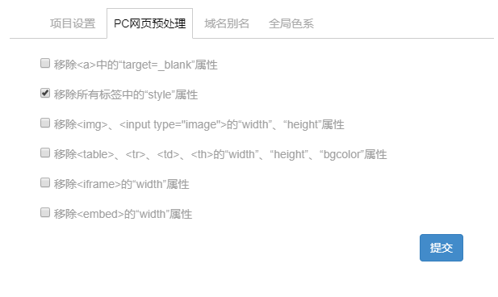
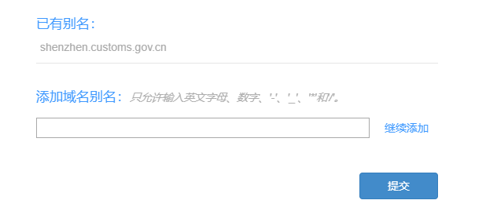
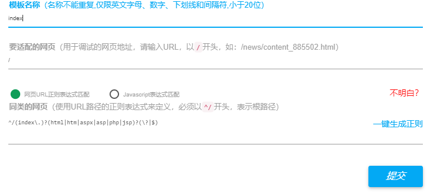

# IDE平台相关介绍

 

## 一、PC网页预处理配置

 

&nbsp;&nbsp;&nbsp;&nbsp;&nbsp;&nbsp;&nbsp;&nbsp;1、&lt;a&gt;需要注意的是，该处的配置会对整个项目产生影响，所以强烈建议在项目刚启动时就对该处进行整体配置。 
&nbsp;&nbsp;&nbsp;&nbsp;&nbsp;&nbsp;&nbsp;&nbsp;2、移除所有标签中的”style”属性：该种预处理需要进行分类讨论，一般建议小型项目勾选该条预处理，中大型项目移除该条预处理，在中大型项目中可以在其数据采集中使用正则替换原有样式的替换。 

 

 

 

## 二、域名别名添加

 

&nbsp;&nbsp;&nbsp;&nbsp;&nbsp;&nbsp;&nbsp;&nbsp;1、域名别名添加规则与创建项目时的添加域名规则相同。 
&nbsp;&nbsp;&nbsp;&nbsp;&nbsp;&nbsp;&nbsp;&nbsp;2、域名别名添加后，只相当于换了一个根域名，页面适配不需要做任何调整。但需要注意的是,根域名下的路径的正则匹配验证是否与以前一样。 
&nbsp;&nbsp;&nbsp;&nbsp;&nbsp;&nbsp;&nbsp;&nbsp;3、在主账号下可以更改原有域名。 
&nbsp;&nbsp;&nbsp;&nbsp;&nbsp;&nbsp;&nbsp;&nbsp;4、此处一般合作伙伴问到的较多，每一次域名需要更换都需要向主管报备。

 

 

 

## 三、模板正则配置

 

&nbsp;&nbsp;&nbsp;&nbsp;&nbsp;&nbsp;&nbsp;&nbsp;1、模板名称命名不做强制要求，但需要简洁易懂并符合IDE平台所要求的。 
&nbsp;&nbsp;&nbsp;&nbsp;&nbsp;&nbsp;&nbsp;&nbsp;2、要适配的网页：该处指的是某一类网站页面的代表页面。 
&nbsp;&nbsp;&nbsp;&nbsp;&nbsp;&nbsp;&nbsp;&nbsp;3、同类的网页 
&nbsp;&nbsp;&nbsp;&nbsp;&nbsp;&nbsp;&nbsp;&nbsp;&nbsp;&nbsp;&nbsp;&nbsp;&nbsp;&nbsp;&nbsp;&nbsp;1)、URL正则，一般都会采用URL正则的匹配规则进行页面的匹配，其要求需要懂基础的正则语法 
&nbsp;&nbsp;&nbsp;&nbsp;&nbsp;&nbsp;&nbsp;&nbsp;&nbsp;&nbsp;&nbsp;&nbsp;&nbsp;&nbsp;&nbsp;&nbsp;2)、javascript表达式匹配需要对页面的DOM存在与否进行判断进行页面的匹配，该处匹配规则建议少用。 

 

 

 

## 四、预览版、测试版、正式版

 

&nbsp;&nbsp;&nbsp;&nbsp;&nbsp;&nbsp;&nbsp;&nbsp;http://cb761c1785e0f612ae322a8e5c6c4ce9.proxy.xcloud.yunshipei.com/&nbsp;&nbsp;&nbsp;&nbsp;&nbsp;&nbsp;&nbsp;&nbsp;预览版地址 
&nbsp;&nbsp;&nbsp;&nbsp;&nbsp;&nbsp;&nbsp;&nbsp;http://shenzhen.customs.gov.cn/?_allmobilizedev=1&nbsp;&nbsp;&nbsp;&nbsp;&nbsp;&nbsp;&nbsp;&nbsp;&nbsp;&nbsp;&nbsp;&nbsp;&nbsp;&nbsp;&nbsp;&nbsp;&nbsp;&nbsp;&nbsp;&nbsp;&nbsp;&nbsp;&nbsp;&nbsp;&nbsp;&nbsp;&nbsp;&nbsp;&nbsp;&nbsp;&nbsp;&nbsp;&nbsp;&nbsp;&nbsp;&nbsp;&nbsp;&nbsp;&nbsp;&nbsp;&nbsp;&nbsp;&nbsp;测试版地址 
&nbsp;&nbsp;&nbsp;&nbsp;&nbsp;&nbsp;&nbsp;&nbsp;http://shenzhen.customs.gov.cn/?_allmobilizedev=0&nbsp;&nbsp;&nbsp;&nbsp;&nbsp;&nbsp;&nbsp;&nbsp;&nbsp;&nbsp;&nbsp;&nbsp;&nbsp;&nbsp;&nbsp;&nbsp;&nbsp;&nbsp;&nbsp;&nbsp;&nbsp;&nbsp;&nbsp;&nbsp;&nbsp;&nbsp;&nbsp;&nbsp;&nbsp;&nbsp;&nbsp;&nbsp;&nbsp;&nbsp;&nbsp;&nbsp;&nbsp;&nbsp;&nbsp;&nbsp;&nbsp;&nbsp;&nbsp;正式版 

 

