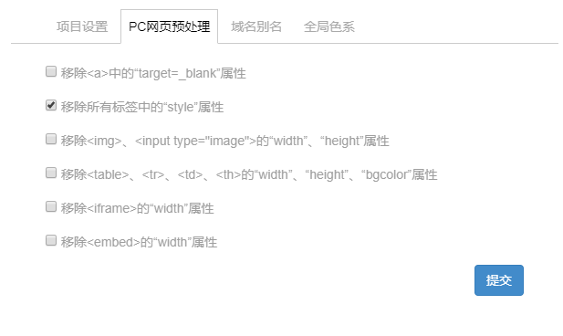
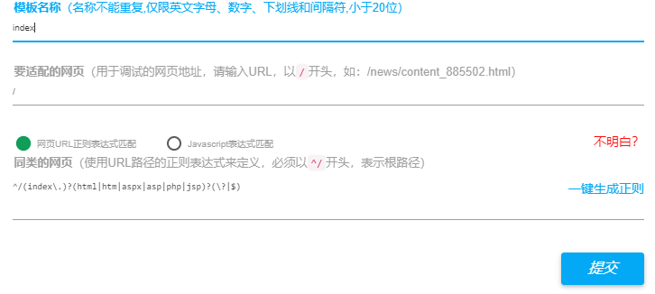

# IDE平台相关配置说明

 

## 一、PC网页预处理配置

 

&nbsp;&nbsp;&nbsp;&nbsp;&nbsp;&nbsp;&nbsp;&nbsp;1、&lt;a&gt;需要注意的是，该处的配置会对整个项目产生影响，所以强烈建议在项目刚启动时就对该处进行整体配置。 
&nbsp;&nbsp;&nbsp;&nbsp;&nbsp;&nbsp;&nbsp;&nbsp;2、移除所有标签中的”style”属性：该种预处理需要进行分类讨论，一般建议小型项目勾选该条预处理，中大型项目移除该条预处理，在中大型项目中可以在其数据采集中使用正则替换原有样式的替换。 

 

 

 

## 二、域名别名添加

 

&nbsp;&nbsp;&nbsp;&nbsp;&nbsp;&nbsp;&nbsp;&nbsp;1、域名别名添加规则与创建项目时的添加域名规则相同。 
&nbsp;&nbsp;&nbsp;&nbsp;&nbsp;&nbsp;&nbsp;&nbsp;2、域名别名添加后，只相当于换了一个根域名，页面适配不需要做任何调整。但需要注意的是,根域名下的路径的正则匹配验证是否与以前一样。 
&nbsp;&nbsp;&nbsp;&nbsp;&nbsp;&nbsp;&nbsp;&nbsp;3、在主账号下可以更改原有域名。 
&nbsp;&nbsp;&nbsp;&nbsp;&nbsp;&nbsp;&nbsp;&nbsp;4、此处一般合作伙伴问到的较多，每一次域名需要更换都需要向主管报备。

 

 

 

## 三、模板正则配置

 

&nbsp;&nbsp;&nbsp;&nbsp;&nbsp;&nbsp;&nbsp;&nbsp;1、模板名称命名不做强制要求，但需要简洁易懂并符合IDE平台所要求的。 
&nbsp;&nbsp;&nbsp;&nbsp;&nbsp;&nbsp;&nbsp;&nbsp;2、要适配的网页：该处指的是某一类网站页面的代表页面。 
&nbsp;&nbsp;&nbsp;&nbsp;&nbsp;&nbsp;&nbsp;&nbsp;3、同类的网页 
&nbsp;&nbsp;&nbsp;&nbsp;&nbsp;&nbsp;&nbsp;&nbsp;&nbsp;&nbsp;&nbsp;&nbsp;&nbsp;&nbsp;&nbsp;&nbsp;1)、URL正则，一般都会采用URL正则的匹配规则进行页面的匹配，其要求需要懂基础的正则语法 
&nbsp;&nbsp;&nbsp;&nbsp;&nbsp;&nbsp;&nbsp;&nbsp;&nbsp;&nbsp;&nbsp;&nbsp;&nbsp;&nbsp;&nbsp;&nbsp;2)、javascript表达式匹配需要对页面的DOM存在与否进行判断进行页面的匹配，该处匹配规则建议少用。 

 

 

 

## 四、预览版、测试版、正式版

 

&nbsp;&nbsp;&nbsp;&nbsp;&nbsp;&nbsp;&nbsp;&nbsp;1、http://cb761c1785e0f612ae322a8e5c6c4ce9.proxy.xcloud.yunshipei.com/&nbsp;&nbsp;&nbsp;&nbsp;&nbsp;&nbsp;&nbsp;&nbsp;预览版地址 

 

&nbsp;&nbsp;&nbsp;&nbsp;&nbsp;&nbsp;&nbsp;&nbsp;&nbsp;&nbsp;&nbsp;&nbsp;&nbsp;&nbsp;&nbsp;&nbsp;在通常开发中大多都会通过预览版进行先行开发，注意此时，此时客户服务器端并不需要添加一句话代码。待开发完成后，联系客户进行一句话代码添加。

 

&nbsp;&nbsp;&nbsp;&nbsp;&nbsp;&nbsp;&nbsp;&nbsp;2、http://shenzhen.customs.gov.cn/?_allmobilizedev=1&nbsp;&nbsp;&nbsp;&nbsp;&nbsp;&nbsp;&nbsp;&nbsp;&nbsp;&nbsp;&nbsp;&nbsp;&nbsp;&nbsp;&nbsp;&nbsp;&nbsp;&nbsp;&nbsp;&nbsp;&nbsp;&nbsp;&nbsp;&nbsp;&nbsp;&nbsp;&nbsp;&nbsp;&nbsp;&nbsp;&nbsp;&nbsp;&nbsp;&nbsp;&nbsp;&nbsp;&nbsp;&nbsp;&nbsp;&nbsp;&nbsp;&nbsp;&nbsp;测试版地址 

 

&nbsp;&nbsp;&nbsp;&nbsp;&nbsp;&nbsp;&nbsp;&nbsp;&nbsp;&nbsp;&nbsp;&nbsp;&nbsp;&nbsp;&nbsp;&nbsp;测试版为正式版的调试版本，即不影响正式上线版本的情况下，对项目作出整体调试，通常项目的后期调试都会放在测试版本中，待调试完成后发布正式上线版本。

 

&nbsp;&nbsp;&nbsp;&nbsp;&nbsp;&nbsp;&nbsp;&nbsp;&nbsp;&nbsp;&nbsp;&nbsp;&nbsp;&nbsp;&nbsp;&nbsp;此处需要注意的是： 
&nbsp;&nbsp;&nbsp;&nbsp;&nbsp;&nbsp;&nbsp;&nbsp;&nbsp;&nbsp;&nbsp;&nbsp;&nbsp;&nbsp;&nbsp;&nbsp;&nbsp;&nbsp;&nbsp;&nbsp;&nbsp;&nbsp;&nbsp;&nbsp;（1）、该版本客户是访问不到的（除非在访问时添加：?_allmobilizedev=1）才可以访问到。 
&nbsp;&nbsp;&nbsp;&nbsp;&nbsp;&nbsp;&nbsp;&nbsp;&nbsp;&nbsp;&nbsp;&nbsp;&nbsp;&nbsp;&nbsp;&nbsp;&nbsp;&nbsp;&nbsp;&nbsp;&nbsp;&nbsp;&nbsp;&nbsp;（2）、开发时需注意：在地址栏中添加了?_allmobilizedev=1之后，其会存储在本地的cookie中，所以开发者即便发布了正式版本，在当前浏览器中想访问正式版本，看到的依然是测试版本。 
&nbsp;&nbsp;&nbsp;&nbsp;&nbsp;&nbsp;&nbsp;&nbsp;&nbsp;&nbsp;&nbsp;&nbsp;&nbsp;&nbsp;&nbsp;&nbsp;&nbsp;&nbsp;&nbsp;&nbsp;&nbsp;&nbsp;&nbsp;&nbsp;（3）关闭测试版本?_allmobilizedev=0 

 

&nbsp;&nbsp;&nbsp;&nbsp;&nbsp;&nbsp;&nbsp;&nbsp;3、http://shenzhen.customs.gov.cn/?_allmobilizedev=0&nbsp;&nbsp;&nbsp;&nbsp;&nbsp;&nbsp;&nbsp;&nbsp;&nbsp;&nbsp;&nbsp;&nbsp;&nbsp;&nbsp;&nbsp;&nbsp;&nbsp;&nbsp;&nbsp;&nbsp;&nbsp;&nbsp;&nbsp;&nbsp;&nbsp;&nbsp;&nbsp;&nbsp;&nbsp;&nbsp;&nbsp;&nbsp;&nbsp;&nbsp;&nbsp;&nbsp;&nbsp;&nbsp;&nbsp;&nbsp;&nbsp;&nbsp;&nbsp;正式版 

 

&nbsp;&nbsp;&nbsp;&nbsp;&nbsp;&nbsp;&nbsp;&nbsp;&nbsp;&nbsp;&nbsp;&nbsp;&nbsp;&nbsp;&nbsp;&nbsp;即客户实际访问到的版本，需要注意的是，在发布正式版前，需要管理员付费才能发布，在发布正式版本后，所有的调试在未重新发布前都不会生效。以后注意，尽量避免在正式版上修改调试。

 

