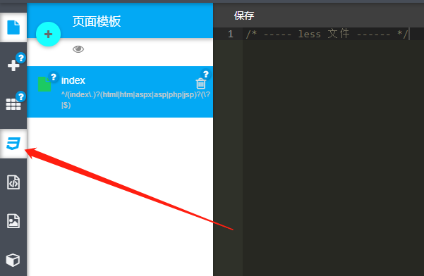

# css文件配置

<br>



<br>

&nbsp;&nbsp;&nbsp;&nbsp;&nbsp;&nbsp;&nbsp;&nbsp;前言:<br>
&nbsp;&nbsp;&nbsp;&nbsp;&nbsp;&nbsp;&nbsp;&nbsp;&nbsp;&nbsp;&nbsp;&nbsp;&nbsp;&nbsp;&nbsp;&nbsp;1、当前文件为全局样式文件,使用的是less语法。<br>
&nbsp;&nbsp;&nbsp;&nbsp;&nbsp;&nbsp;&nbsp;&nbsp;&nbsp;&nbsp;&nbsp;&nbsp;&nbsp;&nbsp;&nbsp;&nbsp;2、Xcloud平台已经集成了amazeui 框架，rem的基准值、相关icon等等都可直接使用<br>

<br>

## 一、基础变量声明及样式类定义


```less
/* 
 * 公共基础css样式变量定义及类别声明
**/

@fc1: #333;            // 一级内容文字色调           	   
@fc2: #666;            // 二级内容文字色调 
@fc3: #999;            // 三级内容色调			   
@lineC: #e5e5e5;       // 边框线条色调
@bgC: #f5f5f5;         // 浅色背景色条
@mc: #2e5c9a;		   // 主色调

.sl{// 行内溢出隐藏
    overflow: hidden;
    text-overflow: ellipsis;
    white-space: nowrap;
}
.resize{// 边距消除
    border: none;
    margin: 0;
    padding: 0;
}	
.flex{ // flex不换行两端布局
    display: flex;
    flex-direction: row;
    flex-wrap: nowrap;
    justify-content: space-between;
}
.hide{ // 元素隐藏
    .resize;
    display: none;
}
input,
button,
select,
textarea { // 还原其默认样式(IOS)
    .resize;
    outline: none;
    -webkit-appearance: none;
    border-radius: 0;
}
.scoll{ // 元素溢出后平滑滚动
    scroll-behavior: smooth;
    -webkit-overflow-scrolling: touch;
}
```
<br>
