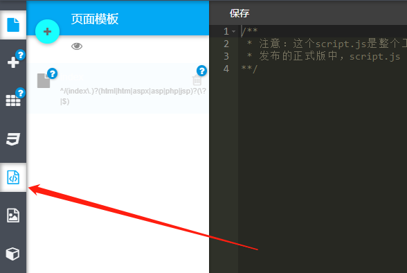

# js配置文件

<br>



<br>

&nbsp;&nbsp;&nbsp;&nbsp;&nbsp;&nbsp;&nbsp;&nbsp;前言:<br>
&nbsp;&nbsp;&nbsp;&nbsp;&nbsp;&nbsp;&nbsp;&nbsp;&nbsp;&nbsp;&nbsp;&nbsp;&nbsp;&nbsp;&nbsp;&nbsp;1、当前文件为全局样式js文件,使用的是zeptoJS。<br>
&nbsp;&nbsp;&nbsp;&nbsp;&nbsp;&nbsp;&nbsp;&nbsp;&nbsp;&nbsp;&nbsp;&nbsp;&nbsp;&nbsp;&nbsp;&nbsp;2、在对部分组件进行操作时,强制建议增加对当前组件判断的操作,防止对其它组件或页面产生影响<br>
&nbsp;&nbsp;&nbsp;&nbsp;&nbsp;&nbsp;&nbsp;&nbsp;&nbsp;&nbsp;&nbsp;&nbsp;&nbsp;&nbsp;&nbsp;&nbsp;3、在这里最好注意使用全局函数进行包裹,但需要注意自调函数与window.onload方法的区别：前者是在解析javascript的时候执行，后者是发生在页面元素全部加载之后（包括图片）执行。根据不同实际场景进行区分使用<br>

```javascript

$(function(){ // 自调函数：在解析到当前代码片段的时候执行

    $(".header-1").length && function(){
        // 当类名为.header-1的组件存在时执行
    }

}());

window.onload = function(){ // onload方法：在页面元素全部加载后执行

}

```