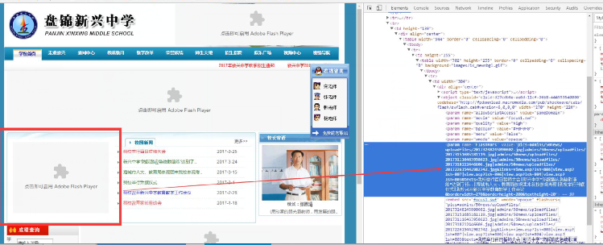

# flash插件问题解析

 

<b>&nbsp;&nbsp;&nbsp;&nbsp;&nbsp;&nbsp;&nbsp;&nbsp;1、问题描述：</b>因移动浏览器本身已不支持Flash，故移动端Flash无法适配。

 

<b>&nbsp;&nbsp;&nbsp;&nbsp;&nbsp;&nbsp;&nbsp;&nbsp;2、解决思路：</b>如若适配，需要与客户协商并要求提供专门的接口。

 

<b>&nbsp;&nbsp;&nbsp;&nbsp;&nbsp;&nbsp;&nbsp;&nbsp;3、栗子：</b>用Flash做的图片/轮播图，能查看到具体路径的，则可适配。如下情况：

 

 

 
