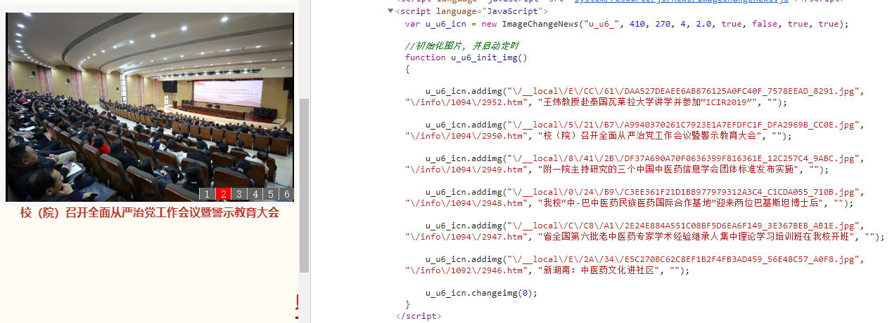

# 动态数据采集问题处理

<br>

&nbsp;&nbsp;&nbsp;&nbsp;&nbsp;&nbsp;&nbsp;&nbsp;前言：<br>

<br>

## 一、PC端轮播图动态数据处理函数封装

<br>

<b>&nbsp;&nbsp;&nbsp;&nbsp;&nbsp;&nbsp;&nbsp;&nbsp;1、PC端数据及效果预览</b>

<br>

 

<br>

<b>&nbsp;&nbsp;&nbsp;&nbsp;&nbsp;&nbsp;&nbsp;&nbsp;2、自定义API中的数据预处理函数封装</b>

<br>

```javascript
    /*
     * 动态bannerJS数据预处理
     * @str string 参数说明： 需要处理的字符串 【必须】 为数据采集的.outerHTML()的script字符串
     * @key string 参数说明： 关键字 【必须】 为需要处理的关键字节点 
     * @num number 参数说明： 需要截取的图片个数
    **/
    jsBannerPress : function(str,key,num){
        var newStr;
        if( typeof(str) === "string" && str != "" && str != null && str != undefined ){
            // 1、对接收的字符串进行预处理,截取{  } 部分 返回数组格式的字符串
            var newStr = str.split("{")[1].split("}")[0].split(key)[0].split(";");
            
            // 2、声明图片数组、链接数组、描述数组
            var data = {
                'status': "success",
                'msg': "成功！",
                'data': {
                    'jsCodeImgUrl' : [],
                    'jsCodeHref' : [],
                    'jsCodeDesc' : []         
                }
            };
            // 3、循环遍历处理
            for( var j = 0; j < newStr.length; j++){
                if( j < num ){
                    var alljsCode = newStr[j].trim() != "" ? newStr[j].split('u_u6_icn.addimg(')[1].split(', "")')[0].split(",") : "";
                    // 预览版环境下需要进行原PC域名的拼接
                    alljsCode[0] != undefined ? data.data.jsCodeImgUrl.push( alljsCode[0].replace(/\\|\"/g,"") ) : "";
                    alljsCode[1] != undefined ? data.data.jsCodeHref.push( alljsCode[1].replace(/\\|\"/g,"") ) : "";
                    alljsCode[2] != undefined ? data.data.jsCodeDesc.push( alljsCode[2].replace(/\\|\"/g,"") ) : "";
                }   
            }
            return data;    
        }else{ // 报错处理
            var data = {
                'status': "error",
                'msg' : "只接收字符串类型的值"
            };
            return data;
        }
    }

```

<br>

<b>&nbsp;&nbsp;&nbsp;&nbsp;&nbsp;&nbsp;&nbsp;&nbsp;3、数据采集中的函数调用及报错处理</b>

<br>

```javascript

/*
 *  轮播图动态脚本数据预处理
*/ 

// 1、获取banner动态数据脚本 str
var JsCode = $('.smbanner .lt script').eq(1).outerHTML();

// 2、调用banner动态脚本处理函数
var newStr = context._helpers.jsBannerPress( JsCode , 'u_u6_icn.changeimg(0);' , 7 );

// 3、对返回值进行判断
var newData;
if( newStr.status == "success" ){
    console.log( newStr.data );
    // 对返回值进行重新赋值：值类型为对象类型
    newData = newStr.data;
    
}else{
    console.error( newStr.msg );
}

var content = [];
!(!newData) && $(newData.jsCodeImgUrl).each(function(i) {
    console.log( i );
    content.push({
        "img": newData.jsCodeImgUrl[i],
        "link": newData.jsCodeHref[i],
        "desc": newData.jsCodeDesc[i]
    });
});
return content;

```

<br>

## 二、

<br>
