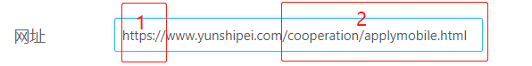
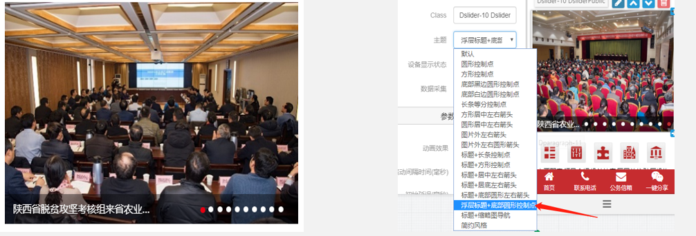
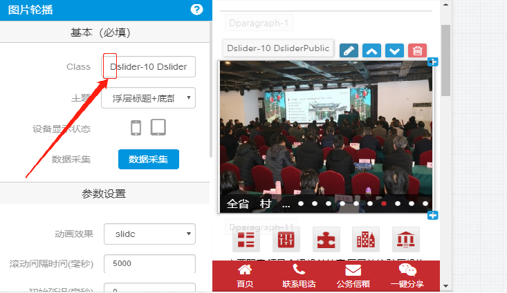
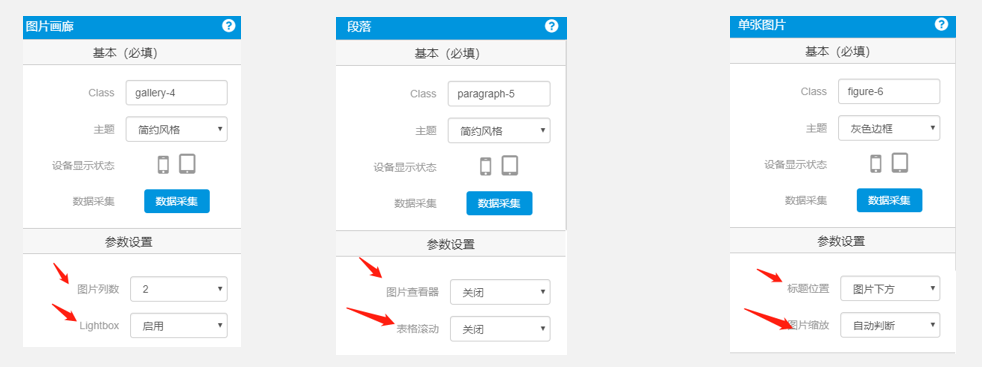
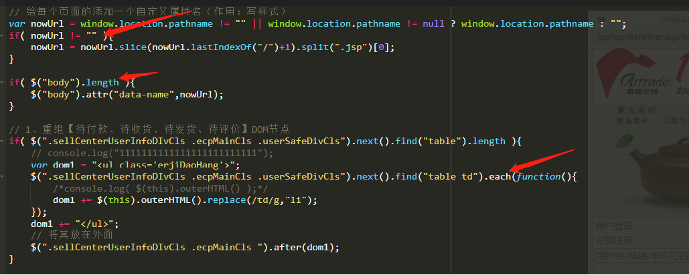
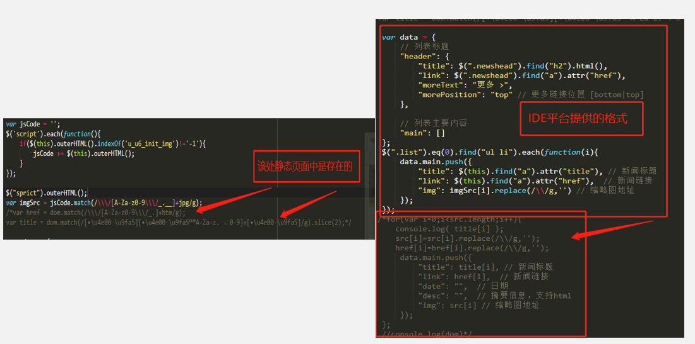
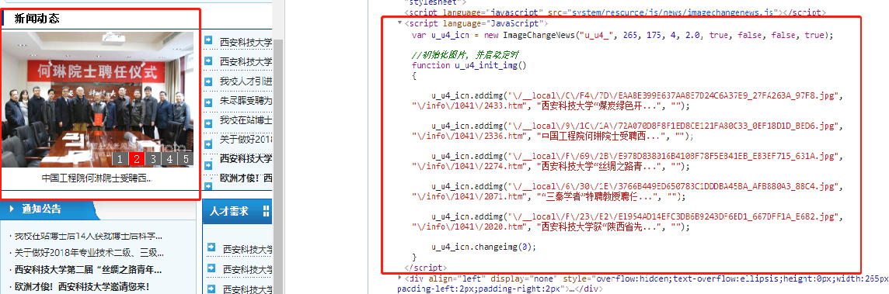
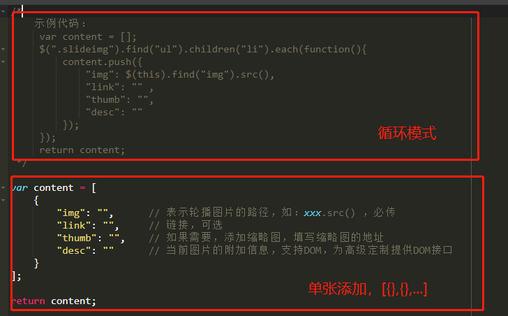
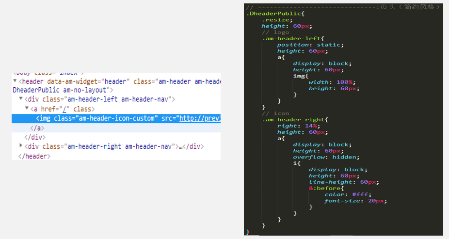

# 相关规范整理

<br>

## 一、项目创建规范

<br>

&nbsp;&nbsp;&nbsp;&nbsp;&nbsp;&nbsp;&nbsp;&nbsp;1、演示项目： 【演示】+ 项目名称
<br>
&nbsp;&nbsp;&nbsp;&nbsp;&nbsp;&nbsp;&nbsp;&nbsp;2、正式项目： 【全程】+ 项目名称
<br>
&nbsp;&nbsp;&nbsp;&nbsp;&nbsp;&nbsp;&nbsp;&nbsp;3、demo项目： 【demo】+ 项目名称
<br>

<br>

 

<br>

<div style="color: red;">

&nbsp;&nbsp;&nbsp;&nbsp;&nbsp;&nbsp;&nbsp;&nbsp;注意：<br>
&nbsp;&nbsp;&nbsp;&nbsp;&nbsp;&nbsp;&nbsp;&nbsp;&nbsp;&nbsp;&nbsp;&nbsp;&nbsp;&nbsp;&nbsp;&nbsp;1)、红框1处需要删除（不删除也没关系，项目建成后,会自动过滤成www.yunshipei.com）<br>
&nbsp;&nbsp;&nbsp;&nbsp;&nbsp;&nbsp;&nbsp;&nbsp;&nbsp;&nbsp;&nbsp;&nbsp;&nbsp;&nbsp;&nbsp;&nbsp;2)、红框2处需要注意，有一些项目不在根域名下，以上图网址建立的项目会自动解析为www.yunshipei.com,所以在项目建成以后，index模板正则需要修改<br>

</div>


<br>

## 二、组件创建规范

<br>
&nbsp;&nbsp;&nbsp;&nbsp;&nbsp;&nbsp;&nbsp;&nbsp;IDE平台组件可大致划分为两类(这里所分的类指的是DOM重组的自由度)：<br>
&nbsp;&nbsp;&nbsp;&nbsp;&nbsp;&nbsp;&nbsp;&nbsp;&nbsp;&nbsp;&nbsp;&nbsp;&nbsp;&nbsp;&nbsp;&nbsp;(1)、IDE平台预定义组件(包括：标题、菜单、图片轮播、图片画廊等等...)<br>
&nbsp;&nbsp;&nbsp;&nbsp;&nbsp;&nbsp;&nbsp;&nbsp;&nbsp;&nbsp;&nbsp;&nbsp;&nbsp;&nbsp;&nbsp;&nbsp;(2)、IDE组件自定义组件(包括：段落、自定义组件)<br>

<br>

&nbsp;&nbsp;&nbsp;&nbsp;&nbsp;&nbsp;&nbsp;&nbsp;规范：<br>
&nbsp;&nbsp;&nbsp;&nbsp;&nbsp;&nbsp;&nbsp;&nbsp;&nbsp;&nbsp;&nbsp;&nbsp;&nbsp;&nbsp;&nbsp;&nbsp;(1)、优先选用与UI设计稿匹配度较高的组件及组件主题的确认<br>

<div style="color: red;">
&nbsp;&nbsp;&nbsp;&nbsp;&nbsp;&nbsp;&nbsp;&nbsp;&nbsp;&nbsp;&nbsp;&nbsp;&nbsp;&nbsp;&nbsp;&nbsp;&nbsp;&nbsp;&nbsp;&nbsp;&nbsp;&nbsp;&nbsp;&nbsp;&nbsp;&nbsp;&nbsp;&nbsp;&nbsp;&nbsp;&nbsp;&nbsp;注意：部分组件的主题有IDE平台预定义好的UI交互JS（如图片画廊中的简约类型、菜单中的部分主题），提前确认好所要使用的主题可以避免组件适配后不能达到客户需要的问题
</div>

<br>

 

<br>

&nbsp;&nbsp;&nbsp;&nbsp;&nbsp;&nbsp;&nbsp;&nbsp;&nbsp;&nbsp;&nbsp;&nbsp;&nbsp;&nbsp;&nbsp;&nbsp;
(2)、在新建组件【class】中添加上自我标识(为了协同开发)<br>

<br>



<br>

&nbsp;&nbsp;&nbsp;&nbsp;&nbsp;&nbsp;&nbsp;&nbsp;&nbsp;&nbsp;&nbsp;&nbsp;&nbsp;&nbsp;&nbsp;&nbsp;(3)、在新建组件时，提前做好新建组件【参数设置】、不建议在新建组件时进行【颜色设置】的修改<br>

<br>



<br>

&nbsp;&nbsp;&nbsp;&nbsp;&nbsp;&nbsp;&nbsp;&nbsp;&nbsp;&nbsp;&nbsp;&nbsp;&nbsp;&nbsp;&nbsp;&nbsp;(4)、在【数据采集】中尽量做好预报错处理，尤其是在使用replace等API时<br>

<div style="color: red;">
&nbsp;&nbsp;&nbsp;&nbsp;&nbsp;&nbsp;&nbsp;&nbsp;&nbsp;&nbsp;&nbsp;&nbsp;&nbsp;&nbsp;&nbsp;&nbsp;&nbsp;&nbsp;&nbsp;&nbsp;&nbsp;&nbsp;&nbsp;&nbsp;注意：在数据采集时，这时属于数据预处理并进行适配DOM重组的重要时刻，一旦使用zeptoAPI但对象为null、undefined的话，页面会直接报错，适配效果丢失。所以在此刻需要着重注意数据抓取时的预防机制
</div>

<br>



<br>


&nbsp;&nbsp;&nbsp;&nbsp;&nbsp;&nbsp;&nbsp;&nbsp;&nbsp;&nbsp;&nbsp;&nbsp;&nbsp;&nbsp;&nbsp;&nbsp;(5)、如果页面为静态页面的，尽量以静态页面数据为主进行采集，且对于text文本采集如果该标签属性中存在，则以标签属性中的数据采集为主<br>

<br>



<br>

&nbsp;&nbsp;&nbsp;&nbsp;&nbsp;&nbsp;&nbsp;&nbsp;&nbsp;&nbsp;&nbsp;&nbsp;&nbsp;&nbsp;&nbsp;&nbsp;(6)、在数据为动态数据时，请注意做好转义处理，防止抓取的内容中的特殊字符影响到适配后移动端页面的信息展示<br>

<div style="color: red;">
&nbsp;&nbsp;&nbsp;&nbsp;&nbsp;&nbsp;&nbsp;&nbsp;&nbsp;&nbsp;&nbsp;&nbsp;&nbsp;&nbsp;&nbsp;&nbsp;&nbsp;&nbsp;&nbsp;&nbsp;&nbsp;&nbsp;&nbsp;&nbsp;注意：如果js中抓取文本内容中存在特殊字符（“ +）等最好进行转码处理
</div>

<br>

<div style="text-align: center;">PC代码</div>



<br>

<div style="text-align: center;">适配代码</div>

```javascript
var content = [];
/*---------------在js中取数据-----------------------*/
var PCImgInfo = $("body >table").eq(3).find("table").eq(2).find("td").eq(0).children("script").eq(1).text().split("{")[1].split("}")[0];

var oldArr = PCImgInfo.split(";"),content = [];
var imgInfo = "";
$(oldArr).each(function(i){
    if(i<5){
        imgInfo = oldArr[i].split("u_u4_icn.addimg(")[1].split('"")')[0].split(",");
        content.push({
            "img": imgInfo[0].replace(/"|"|\\/g,""),
            "link": imgInfo[1].replace(/"|\\"/g,"").replace(/"|"|\\/g,""),
            "desc": imgInfo[2].replace(/"|"/g,"")
        });        
    }

});

return content;

```

## 三、代码规范整理

<br>

&nbsp;&nbsp;&nbsp;&nbsp;&nbsp;&nbsp;&nbsp;&nbsp;&nbsp;&nbsp;&nbsp;&nbsp;&nbsp;&nbsp;&nbsp;&nbsp;(1)、【数据采集】时，应尽量按照原模板的格式进行抓取。<br>

<br>



<br>

&nbsp;&nbsp;&nbsp;&nbsp;&nbsp;&nbsp;&nbsp;&nbsp;&nbsp;&nbsp;&nbsp;&nbsp;&nbsp;&nbsp;&nbsp;&nbsp;(2)、css中需注意尽量少的嵌套来进行代码书写，但需要注意对应DOM结构进行书写(利于后期维护)<br>

<br>



<br>

&nbsp;&nbsp;&nbsp;&nbsp;&nbsp;&nbsp;&nbsp;&nbsp;&nbsp;&nbsp;&nbsp;&nbsp;&nbsp;&nbsp;&nbsp;&nbsp;(3)、js中需要注意在全局添加ready函数，防止程序未加载完成执行，并在js全局数据处理时需要注意进行条件判断存在与否。<br>


&nbsp;&nbsp;&nbsp;&nbsp;&nbsp;&nbsp;&nbsp;&nbsp;&nbsp;&nbsp;&nbsp;&nbsp;&nbsp;&nbsp;&nbsp;&nbsp;(4)、注释：在css中，每隔一个模板进行一段注释，共用组件样式代码与单模板组件样式用注释分开。后期维护时需要添加注释(格式：姓名+日期+修改目的)；在js中，UI交互代码与DOM重组及页面重构代码进行区分书写(如果既在进行重组又涉及到UI交互需添加注释代码进行分割)，并添加简单的注释。<br>
&nbsp;&nbsp;&nbsp;&nbsp;&nbsp;&nbsp;&nbsp;&nbsp;&nbsp;&nbsp;&nbsp;&nbsp;&nbsp;&nbsp;&nbsp;&nbsp;(5)、需要注意：IDE平台不支持es6的语法书写规范。<br>


<br>

## 四、正式上线后的控制台输出

<br>

&nbsp;&nbsp;&nbsp;&nbsp;&nbsp;&nbsp;&nbsp;&nbsp;&nbsp;&nbsp;&nbsp;&nbsp;&nbsp;&nbsp;&nbsp;&nbsp;(1)、要求适配后项目在正式上线后、一律要求不能有控制台输出（pc除外）。<br>
&nbsp;&nbsp;&nbsp;&nbsp;&nbsp;&nbsp;&nbsp;&nbsp;&nbsp;&nbsp;&nbsp;&nbsp;&nbsp;&nbsp;&nbsp;&nbsp;(2)、有必要在代码程序中保留相关console，有利于后期维护。注意在上线后加上注释。<br>

<br>


